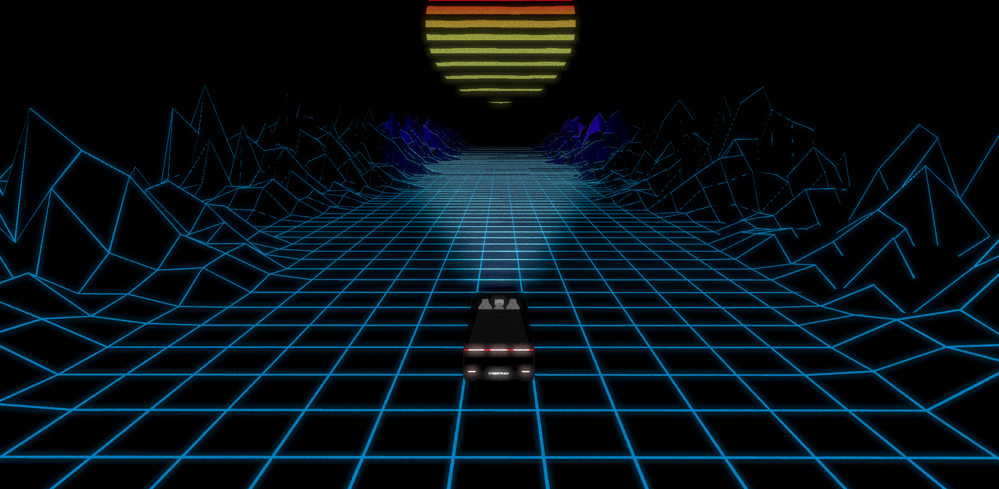

# Vaperwave with Cybertrunck - ThreeJS and React Three Fiber

If you want to see a Tesla cybertrunck in vaperwave world, you are in good place !  
Go check [DEMO](https://vaperwave-tesla.vercel.app/)



## How use it 

For make this project work in your computer, clone this git and make following command bash : 

```bash
npm i 
npm run dev
# or
yarn add
yarn dev
# or
pnpm i
pnpm dev
```

Open [http://localhost:3000](http://localhost:3000) with your browser to see the result.
